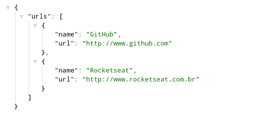

<h1 align="center"> NodeJs Save URL </h1>

Projeto feito através do canal do YouTube da Rocketseat.
[Link da aula aqui](https://www.youtube.com/watch?v=DiXbJL3iWVs)

O desafio era deixar a Api crida com NodeJs dinâmica e atualizar de acordo com as ações do usuário.


<p align="center">  </p>

### Requisitos (ter instalado na máquina):
* [Git](https://git-scm.com/)
* [NodeJS](https://nodejs.org/en/)
* [VsCode](https://code.visualstudio.com/)

### Como rodar o projeto:
Abra seu terminal e clone este repositório com o comando
``` sh
  git clone https://github.com/th1ag0-Zz/save-url-nodejs-api.git
```
depois abra a pasta clonada com o VsCode, abra seu terminal integrado e em seguida digite ``` npm install ``` para instalar as dependências.

Após isto, digite ``` npm start ``` para iniciar o servidor, abra outro terminal e dê o comando ``` npm run api ``` para carregar a API.

E pronto. Tudo funcionando!!!